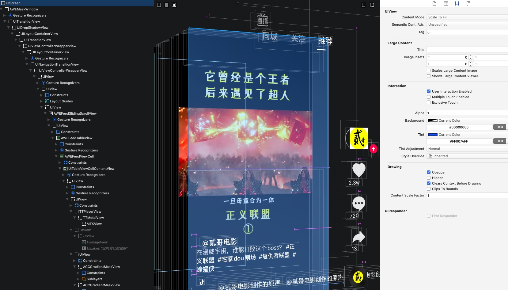
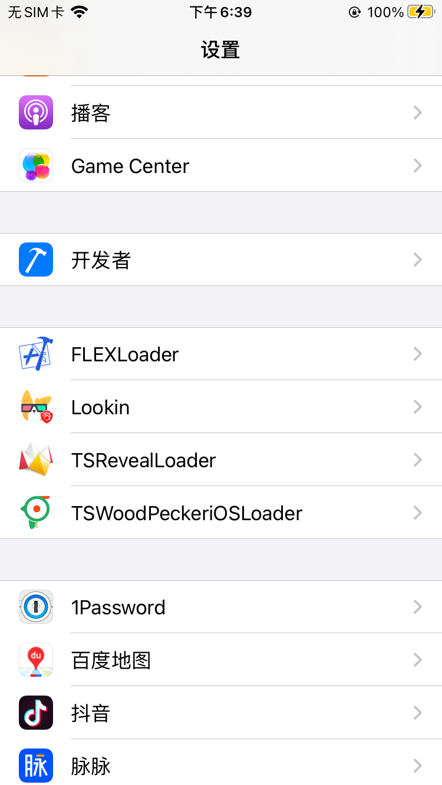
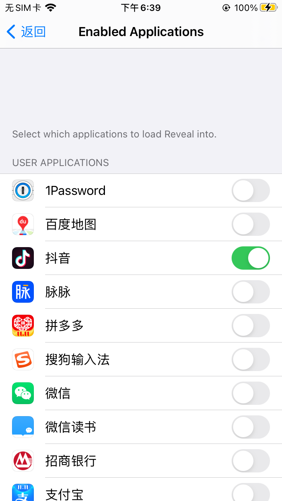

### TSRevealLoader
Dynamically loads Reveal into applications and plugins.

This package uses the RevealServer.framework of Reveal v24(12917) , you can replace it to what you want.

Compatible with `iOS8 ~ iOS14` jailbroken device.

### Problem in iOS11 ~ iOS12
The iOS11 ~ iOS12 jailbroken device does not take effect after installing TSRevealLoader. Because the dlopen function fails to load the RevealServer dynamic library. The error is as follows
> file system sandbox blocked mmap() '/Library/Frameworks/RevealServer.framework/RevealServer'

This code fixed it now.

### Screenshot

#### 效果

#### 系统设置页位置
 

#### 配置应用开关

### Thanks
* original version: https://github.com/lemon4ex/Reveal2Loader
