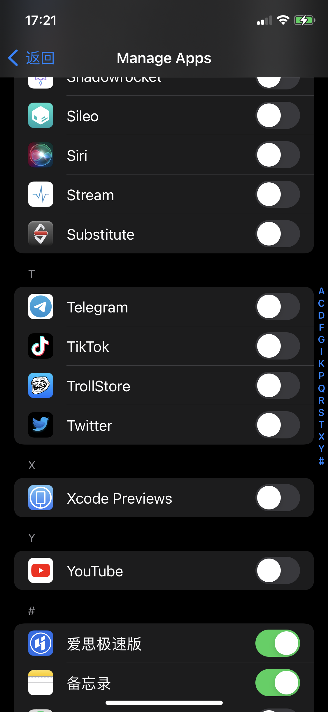

### TSRevealLoader
Dynamically loads Reveal into applications and plugins.

This package uses the RevealServer.framework of Reveal v24(12917) , you can replace it to what you want.

Compatible with `iOS14 ~` jailbroken device.

## 安装
- 配置好本地的 thoes 环境 详情查看 [theos-installation-macos](https://theos.dev/docs/installation-macos)
  - 注意配置好环境变量 `${THEOS}` 以及 对应的 iPhone SDK 是否在 theos 的 SDK 文件夹中
- 将本项目 clone 到本地，修改 Makefile 中的设备 IP 和 PORT，然后执行 `make package install` 即可。
  - 如果想自动安装到手机
  - 配置好 ssh 
  - USB 连接越狱设备: `iproxy 2222 22`
  - 到 `make do`
  - 然后 生成 deb 文件, 就可以安装到 iOS 设备上

## 使用

打开设置页, 找到 RevealLoader，进入 Manage Apps, 选择要你想要调试的程序, 打开开关。

#### 系统设置页位置
 

#### 配置应用开关

### Thanks
* original version: https://github.com/lemon4ex/Reveal2Loader
